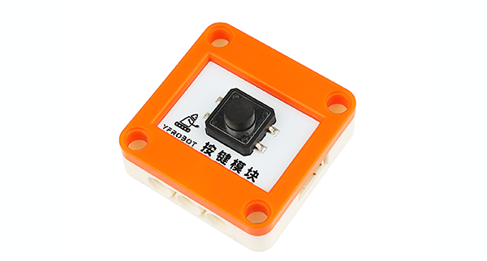

# YFROBOT INPUT（输入型传感器）

---------------------------------------------------------

## 简介 Introduction

本扩展库为Mind+软件设计。

支持YFROBOT 输入型（模块）：按键模块、碰撞检测、磁感应传感器、倾角传感器、红外感应器、震动传感器、热释电传感器、触摸传感器、单/双路巡线传感器、旋转编码器、温度传感器、温湿度传感器DHT11、超声波传感器、MQ气体传感器、灰度传感器、水分传感器、火焰传感器、压力传感器。

## 相关链接 Links
* 本项目加载链接: https://github.com/YFROBOT-TM

* 产品购买链接: [YFROBOT商城](https://www.yfrobot.com/)、[YFROBOT淘宝商城](https://yfrobot.taobao.com/).

## 积木列表 Blocks

## 示例程序 Examples

## 许可证 License
MIT

## 硬件支持列表 Hardware Support
主板型号                | 实时模式    | ArduinoC   | MicroPython    | 备注
------------------ | :----------: | :----------: | :---------: | -----
arduino uno        |             |       √已测试       |             | 
micro:bit        |             |       √未测试       |             | 
mpython掌控板        |             |        √未测试      |             | 
ESP32E        |             |       √未测试        |             | 

## 更新日志 Release Note
* V0.0.1  基础功能完成，Mind+V1.7.1 RC2.0版本软件测试
* V0.0.2  新增单路巡线、MQ气体传感器、灰度传感器
* V0.0.3  适配ESP32E，Mind+V1.7.2 RC3.0版本软件测试
* V0.0.4  新增水分传感器、火焰传感器、压力传感器

## 联系我们 Contact Us
http://www.yfrobot.com.cn/wiki/index.php?title=%E8%81%94%E7%B3%BB%E6%88%91%E4%BB%AC

## 其他扩展库 Other extension libraries
* http://yfrobot.com.cn/wiki/index.php?title=YFRobot%E5%BA%93_For_Mind%2B

## 参考 Reference Resources
